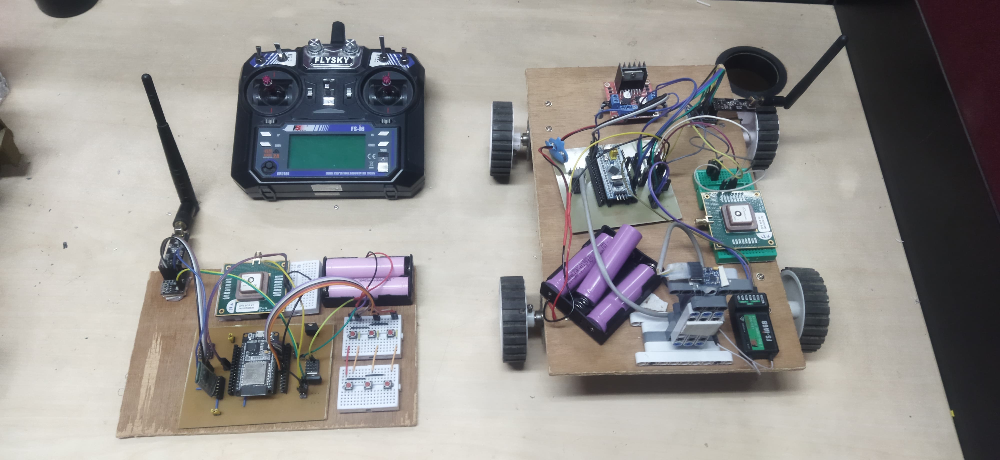

# GPS-Guided Autonomous Rover with Live Web-Based Tracking

This project implements a complete system for an autonomous rover that navigates a pre-defined path of GPS waypoints. It features a handheld ESP32 remote for recording paths and controlling the mission, an STM32-based rover that executes the navigation, and a browser-based visualization tool for live tracking.

## Table of Contents
- [Features](#features)
- [System Architecture](#system-architecture)
- [Hardware Requirements](#hardware-requirements)
- [Software & Libraries](#software--libraries)
- [Setup and Installation](#setup-and-installation)
- [How to Use](#how-to-use)
- [Code Structure](#code-structure)
- [Image](#image)
- [License](#license)

## Features

- **Autonomous Waypoint Navigation:** The rover can autonomously follow a series of GPS coordinates.
- **Manual RC Override:** A standard Flysky RC transmitter can be used to take manual control of the rover at any time.
- **Live Web-Based Tracking:** Real-time position of the rover, its target, and the remote control are visualized on a live map using Leaflet.js.
- **On-the-Go Waypoint Recording:** The handheld remote uses its own GPS to record a path simply by walking it.
- **Wireless Communication:** An NRF24L01 module is used for robust, low-latency communication between the rover and the remote.
- **Web Serial API:** The visualization tool connects directly to the remote control's serial output in the browser, requiring no intermediary software.
- **Data Logging & Export:** The web interface can log the rover's path and export the waypoints as a JSON file.

## System Architecture

The project consists of three main components that work in concert:

1.  **The Rover (STM32):** This is the main vehicle. It's equipped with a GPS module for location, a compass for accurate heading, and an L298N motor driver to control its movement. It receives a list of waypoints from the remote and executes the navigation logic, calculating the required heading and making steering adjustments to stay on course. It continuously transmits its telemetry data (current position, heading, distance to target) back to the remote.

2.  **The Remote (ESP32):** This is the command-and-control unit. The user interacts with it via physical buttons to record a path, send it to the rover, and start or stop the autonomous mission. It receives telemetry from the rover and forwards it to its serial port, acting as a wireless bridge to the visualization interface.

3.  **The Visualizer (Web Browser):** This is the graphical user interface. It's a single HTML file that runs in a browser on a laptop. Using the Web Serial API, it connects to the ESP32 remote (via USB or Bluetooth serial) to read the telemetry data. It then parses this data and updates markers on a live map, showing the real-time locations of the rover and its target.

### Data Flow
1.  **Recording:** The user walks a path with the ESP32 remote, which records a series of GPS waypoints.
2.  **Transmission:** The user presses the "Start Tracing" button. The remote sends the entire list of waypoints and an "auto mode" command to the rover via the NRF24L01.
3.  **Navigation:** The rover receives the waypoints, switches to autonomous mode, and begins navigating to the first point.
4.  **Telemetry:** The rover continuously sends its status (current lat/lon, heading, target lat/lon) back to the remote.
5.  **Visualization:** The remote prints this telemetry data to its serial output. The web visualizer, connected to this serial port, reads the data and updates the map in real-time.

## Hardware Requirements

### 1. Rover
-   **MCU:** STM32 "Blue Pill" (or similar)
-   **GPS:** Any standard NMEA-compatible GPS module (e.g., NEO-6M)
-   **Compass:** QMC5883L Magnetometer
-   **Motor Driver:** L298N Dual H-Bridge Motor Driver
-   **Transceiver:** NRF24L01+ 2.4GHz Wireless Transceiver
-   **RC Receiver:** Flysky PPM Receiver (or any PPM-based receiver)
-   **Chassis:** A two-wheeled or four-wheeled rover chassis with DC motors
-   **Power:** LiPo battery or other suitable power source for the MCU and motors.

### 2. Remote
-   **MCU:** ESP32 Development Board
-   **GPS:** Any standard NMEA-compatible GPS module
-   **Transceiver:** NRF24L01+ 2.4GHz Wireless Transceiver
-   **Interface:** Push buttons or Touch Pins for user input
-   **PC Connection:** For a wireless connection to the laptop, an old model HC-05 which is not a BLE one can be wired to a serial port on the ESP32.
-   **Power:** USB power bank or a LiPo battery.

### 3. Visualization Host
-   A PC or Laptop with a modern web browser that supports the **Web Serial API** (e.g., Google Chrome, Microsoft Edge).

## Software & Libraries

### 1. Arduino IDE
-   Install the board managers for **STM32** and **ESP32**.
-   Install the following libraries via the Library Manager:
    -   `RF24` (for NRF24L01 communication)
    -   `TinyGPSPlus` (for GPS data parsing)
    -   `QMC5883LCompass` (for the compass)
    -   `L298N` (for the motor driver)
    -   `Flysky` (or a relevant PPM library for your receiver)

### 2. Web Visualizer
-   No installation is needed. It relies on the public `leaflet.js` CDN.

## Setup and Installation

1.  **Hardware Assembly:**
    -   Wire the components for the rover and the remote according to the pin definitions at the top of their respective `.ino` files.
    -   Pay close attention to the SPI pins for the NRF24L01 and I2C pins for the QMC5883L compass.
    -   Ensure the rover's motors are connected correctly to the L298N driver.

2.  **Flash Firmware:**
    -   Open `autonomus_GPS_car.ino` in the Arduino IDE, select the correct STM32 board, and upload the code.
    -   Open `autonomus_GPS_remote.ino` in the Arduino IDE, select the correct ESP32 board, and upload the code.

3.  **Launch the Visualizer:**
    -   Connect the programmed ESP32 remote to your laptop via USB. Note the COM port it is assigned.
    -   Open the `GPS Map Visualizer.html` file in a compatible browser (like Chrome).
    -   Click the **"Connect Serial"** button on the webpage and select the COM port corresponding to your ESP32 from the list. The serial data will now be streamed to the map.

## How to Use

1.  **Power On:** Turn on the RC transmitter, the rover, and the ESP32 remote.
2.  **Record a Path:**
    -   With the remote in hand, press the **"Start Record"** button (T4 on ESP32).
    -   Walk the desired path. The remote will automatically save a waypoint every 5 meters (`DISTANCE_TOLERANCE`).
    -   Press the **"Pause Record"** button (T6) when finished.
    -   You can clear the recorded waypoints by pressing the **"Reset Record"** button (T5).
3.  **Start the Mission:**
    -   Place the rover at the desired starting position.
    -   Press the **"Start Tracing"** button (T7) on the remote. This will upload the waypoints to the rover and command it to begin navigating.
    -   The rover will now move from waypoint to waypoint autonomously.
4.  **Monitor Progress:**
    -   Observe the rover's movement in real-time on the web visualizer.
    -   The **blue dot** is the rover, the **red dot** is its current target waypoint, and the **green dot** is the location of the handheld remote.
5.  **Control the Mission:**
    -   **Pause/Manual Mode:** To pause the autonomous mission and switch to manual control, either flip the designated switch on your RC transmitter or press the **"Pause Tracing"** button (T9) on the remote.
    -   **Reset Mission:** To stop the mission completely and clear the waypoints from the rover, press the **"Reset Tracing"** button (T8).

## Code Structure

-   `autonomus_GPS_car.ino`: The complete firmware for the autonomous rover. It handles sensor reading (GPS, Compass), motor control, PPM input, and communication with the remote. It contains all the navigation logic.
-   `autonomus_GPS_remote.ino`: The firmware for the handheld remote. It manages user input for recording/controlling missions, records its own GPS track, and acts as the data relay between the rover and the PC.
-   `GPS Map Visualizer.html`: A self-contained HTML file with embedded JavaScript and CSS. It uses the Leaflet.js library to create the map and the Web Serial API to get live data for visualization.

## Image

## License

This project is licensed under the MIT License. See the [LICENSE](LICENSE) file for details.
